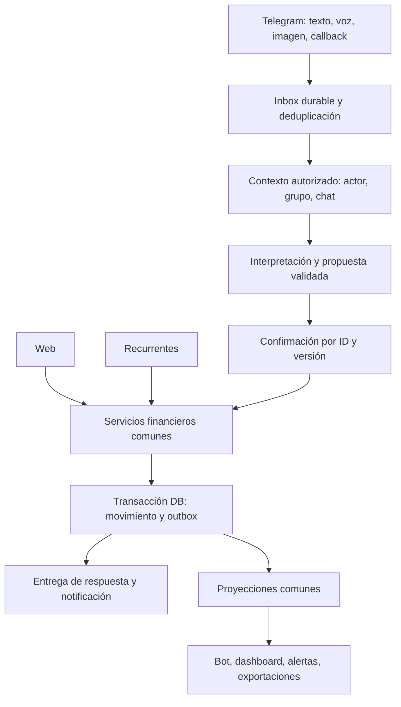

# Hermes — plan de estabilización y evolución

Estado: propuesta para validar/iterar. No autoriza por sí sola su ejecución.
Base: [diagnóstico del repositorio](/Users/estebanindiveri/Downloads/hermes-finantial-tracker/docs/audit/DIAGNOSTICO-2026-09-16.md), commit `7034107`.
Fecha: 16/09/2026 UTC, noche del 15/09 en Argentina.

Actualización: la [validación legacy y propuesta de ejecución segura](/Users/estebanindiveri/Downloads/hermes-finantial-tracker/docs/audit/VALIDACION-LEGACY-Y-EJECUCION.md) contrasta la respuesta de Copilot, corrige el inventario del backlog y reemplaza la secuencia/estimación de ejecución de este documento. Sus reglas de aislamiento, migración y rollback tienen precedencia. Los contratos y casos de aceptación aquí detallados siguen siendo material de trabajo, sujetos a las decisiones explícitas de esa revisión.

Estado ejecutable y responsables vigentes: consultar el [registro de cierre,
owners, bloqueos y condiciones de reentrada](../engineering/IMPLEMENTATION-STATUS.md#operational-closure-register--authoritative-26092026).
Ningún corte se considera cerrado solo por terminar código; los stoppers deben
conservar owner y condición explícita de desbloqueo allí.

## 1. Resultado buscado

Que cualquier miembro autorizado pueda registrar un movimiento desde Telegram —texto, audio, foto o botones— y verlo reflejado correctamente en el dashboard, con monto, tipo, categoría, período y grupo correctos, sin duplicaciones ni pérdidas silenciosas.

Mejorar las funcionalidades actuales antes de ampliar el catálogo. Las fases tienen puertas de salida verificables: no basta con “terminé el código”, “compila” o “probé una frase”.

La primera meta es una versión internamente validada del core. Después se habilita crecimiento funcional sobre contratos estables. No se promete ausencia absoluta de defectos ni una certificación externa.

## 2. Decisiones de producto y valores recomendados

Resolverlas al comenzar, documentarlas y convertirlas en ejemplos automatizados. No bloquean contener vulnerabilidades.

| Decisión | Recomendación |
|---|---|
| ¿Qué es un ingreso? | Tipo explícito de movimiento; la categoría describe el origen, no determina el signo. |
| ¿Ingreso mensual configurado o cobrado? | Distinguir previsión de ingreso realizado. Preservar comportamiento actual hasta aprobar y migrar esta diferencia; evitar sumar el mismo sueldo dos veces. |
| ¿Todo gasto requiere confirmación? | Durante estabilización: sí para lenguaje libre, voz y OCR. Comando inequívoco puede mantener confirmación actual. Optimizar después con medición. |
| ¿Qué hace una ambigüedad? | Pregunta específica; no elige número/categoría arbitrariamente. |
| ¿Qué período se registra? | Fecha local válida en Argentina y mes derivado; admitir imputación distinta solo como regla explícita y visible. |
| ¿Qué grupo recibe el movimiento? | El grupo de la propuesta, mostrado antes de confirmar; revalidar membresía al confirmar. Cambiar grupo no traslada una propuesta silenciosamente. |
| ¿Ingreso consume presupuesto o pide reintegro? | No por defecto. Reintegro pertenece a gasto; devolución de dinero requiere una semántica distinta si se incorpora. |
| ¿Cómo funcionan límites duros? | Conservar la política actual de rechazo, aplicada en todos los canales al escribir. No cambiarla por canal ni por IA. |
| ¿Qué frecuencias se garantizan? | Mensual primero. Ocultar/rechazar weekly/yearly hasta implementar calendario y pruebas. |
| ¿Qué prueba un comprobante? | Que el usuario aportó una imagen; no verifica una acreditación bancaria. Mantener estado “declarado/confirmado por usuario”. |
| ¿Qué muestra un balance global? | Deudas de liquidación donde participa ese usuario, con política estable por sesión; no saldo de terceros convertido en deuda propia. |

## 3. Arquitectura objetivo mínima

Conservar un monolito modular. No hace falta introducir microservicios. El procesamiento diferido debe tener ejecución durable real, no promesas sin esperar dentro de una función serverless.

Contratos propuestos:

- `AuthorizedContext`: actor, grupo/sesión, rol vigente y canal; resuelto por el servidor.
- `FinancialCommand`: unión discriminada de gasto, ingreso, consulta, simulación, alta/confirmación recurrente. Una consulta nunca llega a un writer.
- `Money`: moneda e importe en unidades menores enteras, con límites y redondeo documentados. Cotización decimal/snapshot separado. Migrar con conciliación; no reinterpretar silenciosamente montos existentes.
- `MovementDraft`: ID, actor, grupo, tipo, monto, categoría, fecha, fuente, versión, expiración y razones de incertidumbre.
- `recordMovement`: valida permisos, categoría, dinero, período, cotización y presupuesto; persiste una sola vez por clave de operación.
- `recordSplit / recordPayment`: comprueban participantes, sumas y estado de sesión; preservan balance cero y atomicidad.
- `InboxEvent`: clave única, recibido/procesando/completado/reintentable/fallido, lease y contador de intentos.
- `OutboxEvent`: entrega pendiente/enviada/fallida, destinatario, correlación, intentos y próximo intento.

La IA no llama directamente a DB ni decide permisos, signos, saldo o excepción presupuestaria. Propone datos; el dominio los valida. La confirmación humana tampoco reemplaza controles de acceso o unicidad.

## 4. Fases de ejecución

Estimación orientativa para una persona técnica responsable con QA del producto: **20–34 jornadas efectivas**, más observación de uso real durante 14 días. No es una promesa de calendario; reconciliación de datos y estado real de producción pueden cambiarla. Agentes ayudan a implementar, pero no sustituyen revisión y gates.

### Fase 0 — Línea base y contención (1–2 jornadas)

Objetivo: detener escrituras no autorizadas y establecer un punto reproducible.

1. Identificar SHA efectivamente publicado, variables presentes sin revelar valores, crons reales y configuración del webhook.
2. Registrar incidencias H01–H20 con propietario, prioridad, evidencia y condición de cierre.
3. Corregir H01/H02 y contexto/destinatarios H03. Autenticación antes de toda rama operativa; controles negativos con usuarios A/B.
4. Restringir mediante flags los recorridos de alto riesgo que no puedan corregirse de inmediato: autoejecución recurrente, audio de grupo hacia contexto personal y confirmaciones OCR ambiguas. Mantener disponible registro manual validado.
5. Preparar backup y procedimiento de recuperación verificable. Crear staging con DB, bot y credenciales distintos.
6. Acordar las decisiones de producto de la sección 2 y registrar las divergencias encontradas.

Salida:

- Ningún cron con escritura responde satisfactoriamente sin autorización.
- A no puede confirmar/omitir una ejecución de B.
- Un exmiembro no puede operar en el grupo por ningún canal.
- Destinatarios de prueba nunca reciben datos de otro usuario/grupo.
- Existe matriz de despliegue y recuperación, con responsable.

### Fase 1 — Recuperar confianza en la ingeniería (2–4 jornadas)

Objetivo: hacer que una regresión detenga un merge/publicación.

1. Fijar Node/npm; usar lockfile e instalación limpia reproducible.
2. Unificar Jest, separar E2E, reparar lint y scripts de typecheck/test/build.
3. Clasificar los 17 fallos: bug de producto, contrato cambiado o test defectuoso. Corregir la causa; reemplazar pruebas de texto fuente por comportamiento cuando corresponda.
4. Incorporar pruebas reales de DB en memoria/entorno aislado, además de mocks.
5. Reconciliar journal, SQL manual y schema; migración desde DB vacía y desde snapshot anonimizado de la versión anterior.
6. CI obligatorio: instalación, lint, TypeScript, unitarios, integración, migraciones, build y smoke E2E. Publicación desde SHA que aprobó exactamente esos controles.
7. Playwright debe fallar si el destino no es un entorno de prueba explícito. Credenciales de fixtures locales; revisar cuenta de test expuesta si existiera en producción.
8. Declarar dependencias directas y ejecutar análisis de dependencias/secretos con reporte, sin upgrades masivos no relacionados.

Salida:

- Checkout limpio reproduce todos los controles con un comando documentado.
- Cero tests fallidos en el alcance protegido; excepciones fuera del core solo con issue, motivo, dueño y vencimiento.
- DB nueva tiene todas las tablas, índices y constraints necesarios.
- Smoke atraviesa middleware → ruta → DB real, no headers fabricados únicamente en tests.
- Un test de regresión deliberadamente roto bloquea merge/publicación.

### Fase 2 — Integridad financiera común (5–8 jornadas)

Objetivo: una operación tiene el mismo resultado en todos los canales.

1. Crear servicios de alta, anulación y consulta de movimientos con tipo explícito ingreso/gasto.
2. Definir representación monetaria, redondeo, snapshot de cambio y semántica de ingreso previsto/realizado.
3. Migrar tipos históricos con reglas revisables; conciliar totales antes/después por grupo/mes. Marcar ambiguos para revisión; no “arreglar” historia por heurística.
4. Llevar web, callbacks, OCR y recurrentes a ese servicio. Presupuestos se validan al commit, no solo al preparar la propuesta.
5. Reparar recurrentes: tipo de cambio configurado, categorías del grupo, unicidad por ocurrencia y transición condicional.
6. Corregir balances globales, conservación de suma en splits, edición de cuotas y tratamiento de pagos ante cancelaciones.
7. Unificar proyecciones: resumen, gráficos, exportaciones y avisos diarios.
8. Separar commit de notificación mediante outbox; preservar ID y estado aun cuando falle Telegram.

Salida:

- Ingreso aumenta resultado y nunca gasto en ninguna vista.
- Mismo movimiento produce iguales resultados por web/bot/OCR/recurrente.
- Dos confirmaciones concurrentes crean un movimiento; dos gastos concurrentes respetan límite duro.
- Fallo en el segundo insert de un split no deja filas parciales.
- Caso A/B/C de H13 no muestra deuda de A.
- Conciliación histórica sin diferencias inexplicadas; cambios deliberados registrados.

### Fase 3 — Telegram como canal principal confiable (4–6 jornadas)

Objetivo: toda interacción es trazable y recuperable.

1. Normalizar updates de texto, audio, imagen y callback en un pipeline común.
2. Implementar inbox único por bot/update y procesamiento con lease/reintento. Concurrencia por propuesta/conversación bien definida.
3. Autenticar, resolver chat y grupo antes de OCR/STT.
4. Sustituir callbacks genéricos por propuesta+versión. Verificar actor, chat, grupo, expiración y estado.
5. Persistir resultado antes de responder “registrado”; quitar heurística de transacción reciente.
6. Retener errores recuperables; agregar reparación/reintento operacional sin volver a escribir movimientos.
7. Unificar adaptadores Telegram con timeout, clasificación de 400/429/5xx y política de retry. No ignorar todo 400 como “mensaje no modificado”.
8. Respetar límites de tamaño/duración, escapar salida HTML, paginar mensajes largos y degradar a ingreso manual con borrador preservado.
9. Corregir calendario mensual, días 29/30/31, mes/zona horaria y cron durable de generación.

Salida:

- Repetir mismo update/callback 10 veces, incluso en paralelo, conserva una sola operación.
- Enviar propuestas A/B y pulsar botón de A afecta A o informa expiración; nunca B.
- Audio grupal no revela ni altera el dashboard personal.
- Caída tras commit y antes del envío se recupera sin duplicar.
- Usuario puede cancelar, corregir y retomar un recorrido con respuestas claras.

### Fase 4 — Interpretación y OCR medibles (4–6 jornadas)

Objetivo: mejorar comprensión sin ampliar el riesgo financiero.

1. Comandos y botones exactos antes de Groq; funcionamiento básico aun sin API key.
2. Parser único de dinero argentino y moneda explícita. Separar cantidades, fechas, cuotas y monto.
3. Clasificar consulta/simulación/negación/recurrente antes de sugerir escritura.
4. Enviar catálogo real de categorías del grupo y aliases mantenibles, sin confiar en nombres como permisos.
5. Schema por intención, validación semántica y structured outputs si el modelo es compatible.
6. Versionar prompt/modelo/parser/corpus; conservar trazas redactadas de errores y motivos de decisión.
7. OCR por evidencia de total; preservar fecha y asociación de ticket a movimiento. No elegir el mayor número ni leer SUBTOTAL como TOTAL.
8. Comparar modelos/proveedores con corpus separado de desarrollo y evaluación. Empezar por medir modelo actual; cambiar solo si mejora el objetivo.
9. Evaluar acentos/ruido/voz rápida y transcripciones de números; proponer confirmación reforzada cuando monto/tipo difieran entre extractores.

Salida:

- Casos H07/H08/H15 cubiertos por pruebas permanentes.
- Ninguna consulta, negación o entrada maliciosa del conjunto crítico produce escritura automática.
- Comandos deterministas, “Recurrentes”, “Pendientes” y registro estructurado funcionan con Groq caído.
- OCR sin total confiable pregunta el monto y conserva el resto del borrador.
- Informe comparativo de extracción, aclaraciones, errores, latencia y costo; decisión de modelo documentada.

### Fase 5 — Validación de release y escala (4–8 jornadas, más observación)

Objetivo: demostrar estabilidad y dejar preparada la próxima iteración.

1. QA cruzado de Telegram y dashboard con casos de negocio del usuario y dos o más miembros.
2. Pruebas de carga de ingestión/confirmación y saturación de proveedores sobre staging.
3. Métricas y alertas de error, cola, duplicados, operaciones pendientes y discrepancias de saldo.
4. Reparar UI de excepciones, historial por mes/grupo, errores de reintegro parciales y visibilidad de ingreso.
5. Paginación e índices guiados por medición; reducir consultas por sesión y lotear crons.
6. Ensayar restore y rollback de código con compatibilidad de schema. Reversión funcional por flags cuando deshacer DB implique pérdida.
7. Despliegue gradual a grupo piloto, comprobaciones de release y ventana de observación.
8. Actualizar documentación viva y archivar planes históricos como históricos.

Salida:

- Cumple matriz de aceptación y scorecard siguiente.
- No hay P0/P1 abiertos en recorridos habilitados.
- Se conocen capacidad medida, límites operativos y disparadores de escalado.
- Paquete de evidencia por SHA y aprobación de producto.

## 5. Backlog ejecutable y dependencias

Cada ítem debe convertirse en issue/PR con evidencia de falla antes, corrección, prueba y efecto sobre datos. No se crearon issues remotos durante esta auditoría.

| ID | Entregable | Hallazgos | Fase / depende de |
|---|---|---|---|
| ACT-01 | Autorización de cron y ejecuciones | H01/H02 | 0 |
| ACT-02 | Membresía vigente y destinatarios aislados | H03/H06 | 0 |
| ACT-03 | Runtime, Jest, lint y CI obligatorio | H18 | 1 |
| ACT-04 | Migraciones reconciliadas y restore de prueba | H16/H20 | 1 |
| ACT-05 | Contrato financiero y tipo de movimiento | H09/H10/H11 | 2; decisiones de producto |
| ACT-06 | Servicio único + atomicidad + dinero | H04/H09/H17 | 2; ACT-04/05 |
| ACT-07 | Proyecciones de ingreso/gasto coherentes | H10/H19 | 2; ACT-05 |
| ACT-08 | Splits válidos y balance global correcto | H13/H14 | 2; ACT-03/04 |
| ACT-09 | Inbox/outbox + recuperación | H04/H17 | 2–3; ACT-04/06 |
| ACT-10 | Propuestas y callbacks con identidad | H05 | 3; ACT-06/09 |
| ACT-11 | Enrutamiento voz/texto/foto y límites | H06/H20 | 3; ACT-02/09 |
| ACT-12 | Recurrentes: calendario, contexto, cotización | H11/H12/H19 | 2–3; ACT-06 |
| ACT-13 | Parser monetario e intenciones seguras | H07/H08 | 4; ACT-05 |
| ACT-14 | OCR verificable con corrección conservada | H15 | 4; ACT-10/13 |
| ACT-15 | Dataset/evals y elección de modelo | H07/H08/H15 | 4; ACT-13/14 |
| ACT-16 | UX de excepciones, errores y períodos | H19 | 5; ACT-07/12 |
| ACT-17 | Observabilidad, retención, carga y release | H17/H20 | transversal; cierre en 5 |
| ACT-18 | Docs vivas y handoff técnico | todos | transversal |

Orden inicial recomendado de PRs: seguridad → herramienta de calidad/migraciones → regresiones de negocio → servicio financiero/ingresos → identidad de operaciones → Telegram → recurrentes/splits → IA/OCR. Cada PR debe ser desplegable y revisable por separado; no esperar un mega-merge final.

## 6. Matriz mínima de aceptación

| Caso | Canales/variantes | Resultado obligatorio |
|---|---|---|
| Gasto 13.568 supermercado | Comando, texto, voz, web | Un gasto de 13.568; saldo disminuye correctamente. |
| Gasto 16.739 salidas pareja | Texto y audio; Groq normal/fallando | Categoría correcta o aclaración explícita. |
| Ingreso 492.900 | Web, texto, voz, callback | Suma; no aparece como gasto en resumen/gráfico/export/alerta. |
| Dinero argentino | 1.234,56; 19,50; 15k; quince mil; mil quinientos | Monto exacto o pregunta, nunca sustitución silenciosa. |
| Cantidades múltiples | 2 kilos por 5000; 3 cuotas; fecha y monto | Distingue unidades/fecha/importe; no toma primer número a ciegas. |
| Consulta/negación | “puedo gastar…”, “no gasté…”, “sin reintegro” | No crea movimiento ni solicitud incorrecta. |
| Recurrentes | Crear, editar, pausar, listar, confirmar, omitir | Mismo dominio que gasto manual; autorización vigente. |
| Meses límite | Febrero bisiesto/no, días 28–31, medianoche Argentina | Fecha válida; mes y vencimiento documentados. |
| Ticket | Total/subtotal/IVA/código; total al final; foto borrosa | Selección correcta o monto manual; fecha preservada. |
| Dos propuestas | A luego B, botón viejo, cambio de grupo | Nunca confirmar otro borrador. |
| Duplicado/concurrencia | Retransmisión, doble click, dos workers | Una sola escritura financiera y resultado consistente. |
| Fallo externo | Timeout/429/500/JSON inválido; Telegram tras commit | Reintento seguro o salida manual; no pérdida silenciosa. |
| Límites | Exacto, exceso, blando, edición después de propuesta | Regla idéntica en todos los canales al commit. |
| Autorización | Sin sesión, A/B, exmiembro, ID de otra categoría | Rechazo; cero mutaciones de datos ajenos. |
| Compartidos | 2–5 personas, cuota cero, pagos parciales/cruzados | Conservación de dinero y deuda del usuario correcta. |
| Anulación | Gasto con reintegro, ingreso, split con pago previo | Política explícita, trazabilidad y saldos coherentes. |
| Migración/restauración | DB vacía y snapshot anterior | Schema completo y conciliación antes/después. |

Pruebas necesarias: unitarias de dominio; integración con SQLite/libSQL real; pruebas del webhook con Telegram/Groq simulados; E2E web y pruebas de contrato vivo en staging. Los mocks no prueban constraints, concurrencia o middleware real.

## 7. Scorecard de release: qué significa “certificado” aquí

Certificación interna = versión identificada con evidencia repetible y riesgos residuales aceptados. No es una garantía de cero defectos.

| Garantía | Criterio propuesto |
|---|---|
| Seguridad de datos | 100% de matriz negativa de autorización pasa; sin P0/P1 abiertos. |
| Exactitud crítica | 100% del corpus obligatorio de montos/tipos/grupos y reglas financieras pasa. |
| Idempotencia | Cero movimientos duplicados en pruebas de reenvío y concurrencia; constraints comprobados. |
| Conciliación | Diferencia cero en unidades menores entre movimientos y proyecciones bajo la misma política; redondeos explícitos. |
| IA en evaluación | Objetivo inicial ≥98% de monto+tipo correctos en entradas inequívocas; ambiguas deben aclararse. Cero falsas escrituras en negativas críticas. |
| OCR | Monto exacto o abstención explícita; medir por separado tasa de extracción y corrección manual. Nunca optimizar “detectó algo” a costa de inventar. |
| Flujo operativo | Objetivo inicial ≥99,5% de comandos válidos completados o recuperados en ventana acordada; medir fallos finales separadamente. |
| Latencia | Presupuestos iniciales: ACK durable p95 <1 s; comando simple <3 s; IA texto <8 s; audio/OCR <20 s. Reajustar con baseline, sin fingir mediciones actuales. |
| Entrega | Sin backlog de outbox/inbox vencido; alerta ante acumulación o intentos agotados. |
| Recuperación | Restore demostrado y procedimiento con RPO/RTO acordados; propuesta inicial RPO ≤24 h, RTO ≤2 h, a validar con capacidades/costo reales. |
| Observación | 14 días de piloto sin incidentes críticos; si el volumen es bajo, complementar con corpus/replays sintéticos, no inferir calidad por ausencia de uso. |

Dataset propuesto: al menos 200 mensajes etiquetados (incluyendo consultas/negaciones/ambigüedad), 50 transcripciones y 50 tickets consentidos o sintéticos. Separar desarrollo/evaluación; reportar tamaño, distribución y errores por segmento. No usar datos personales sin anonimizar.

Métricas: update recibido, aceptación durable, propuesta creada, aclaración, confirmación, movimiento persistido, respuesta entregada; tasas por canal y versión de parser/modelo. Registrar operación/grupo seudonimizados, duraciones y código de error; evitar texto crudo por defecto.

Paquete de release: SHA, versiones, migraciones, resultados CI, corpus y errores conocidos, conciliación, smoke de staging, plan/ensayo de rollback y decisión de habilitación. Conservar evidencia ligada a la versión.

## 8. Documentación que debe quedar como fuente vigente

No más planes que compiten con la implementación sin indicar su estado.

| Documento propuesto | Contenido mínimo / dueño |
|---|---|
| PRODUCT-CONTRACT | Ingreso/gasto, previsión vs realizado, presupuesto, fechas, reintegros, deuda. Responsable de producto. |
| ARCHITECTURE + ADR | Límites de módulos, por qué se usa inbox/outbox, representación monetaria, política de cotización. Responsable técnico. |
| TELEGRAM-FLOWS | Estados, comandos, callbacks, expiración, autorización, fallos y recuperación. Dueño del bot. |
| AI-EVALUATION | Dataset, schema por intención, prompts/modelos/versiones, métricas, cambio de proveedor. Dueño IA/QA. |
| DATA-MIGRATIONS | Schema vigente, conciliación, rollback/forward-fix y procedimiento para datos ambiguos. Dueño datos. |
| RELEASE-RUNBOOK | Staging, gates, flags, piloto, monitoreo y restore. Responsable de release. |
| BACKLOG | Un registro vivo con prioridad, estado, dependencias y criterio de aceptación. Producto/técnico. |

Estos nombres son entregables propuestos, todavía no creados por la auditoría. El README debe resumir la realidad y enlazarlos. Los documentos antiguos deben marcarse “histórico/sustituido”, sin borrar decisiones relevantes.

## 9. Reglas para desarrollar con agentes y evitar perder contexto

1. Antes de cambiar: leer contrato del dominio, pruebas de regresión y módulos consumidores. Describir qué invariantes se pueden romper.
2. Una rama/PR por cambio acotado; si hay trabajo simultáneo, usar checkouts aislados y coordinar quién modifica cada módulo.
3. Un bug financiero debe incluir reproducción previa y regresión permanente; una prueba de helper no sustituye al recorrido que falló al usuario.
4. Cada nueva entrada se conecta al servicio existente; no se permite un nuevo writer financiero dentro de un handler.
5. Checklist de impacto: web, texto, audio, OCR, callbacks, recurrentes, dashboard, exportación y alertas. Indicar qué se probó y qué no aplica.
6. Revisar las correcciones con evidencia independiente del razonamiento que las produjo. El modelo que redactó el código no “certifica” su propia conclusión.
7. Handoff breve: SHA, objetivo, contratos afectados, resultados exactos, riesgos y siguiente paso. Nunca “todos pasan” si se corrió solo un subconjunto.
8. Fallos preexistentes del core son trabajo pendiente visible, no permiso permanente para publicar en rojo.
9. Actualizar contrato/ADR cuando cambia comportamiento; evitar prompts crecientes como sustituto de reglas de dominio.
10. Merge y release solo contra el SHA efectivamente validado. Una prueba vieja no valida cambios posteriores de Copilot.

## 10. Qué postergar y cuándo escalar

Postergar export PDF, nuevas integraciones, estadísticas avanzadas, más frecuencias, registro sin confirmación y cambio de modelo “por intuición” hasta cerrar core.

Agregar workers/concurrencia adicional cuando haya medición de cola o latencia; optimizar índices y paginación antes de migrar DB. Considerar otra base si las transacciones, contención o requisitos medidos exceden lo que la configuración actual puede garantizar. No declarar capacidad para miles de usuarios sin prueba de carga.

Primera aprobación recomendada: **fases 0 y 1**, con el diseño de contratos de fase 2. Al cerrar esas fases, revisar esfuerzo restante con datos reales y ejecutar el resto por puertas de salida. La auditoría actual no modifica comportamiento de producción.
