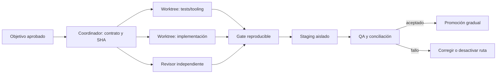

# Entorno de agentes para Hermes Finance

Estado: base propuesta e inicialmente materializada. No instala dependencias, plugins, MCP ni hooks y no modifica la aplicación.

## Decisión

Usar un harness pequeño y específico de Hermes:

1. `AGENTS.md` mantiene invariantes y límites permanentes.
2. `.agents/skills/hermes-safe-change/SKILL.md` contiene el flujo reutilizable de implementación.
3. `.github/copilot-instructions.md` adapta Copilot al contrato canónico sin duplicarlo.
4. CI, tests y hooks aplican mecánicamente las reglas que puedan verificarse.
5. El coordinador divide trabajo independiente en worktrees y conserva la integración.

## Evaluación de las instrucciones globales de Copilot

### Conservar

- Investigar causa raíz y dependencias antes de editar.
- Regresión para bugs y TDD cuando aporta evidencia.
- Revisión independiente y verificación posterior.
- Commits pequeños, secretos fuera del repositorio y validación de entradas.
- Revisar impacto fuera de los archivos modificados.

### Corregir

- Son globales y contienen reglas de Express incompatibles con Next.js App Router.
- “Leer el contexto completo” y auditar toda la aplicación en cada cambio gasta contexto y favorece revisiones superficiales. Usar routing de documentos y mapa de consumidores.
- TDD estricto para toda tarea crea tests ceremoniales en documentación/configuración. Exigirlo para bugs y comportamiento; calibrarlo para cambios mecánicos reversibles.
- Happy/edge/error en cada cambio y 80% global no garantizan el core financiero. Priorizar invariantes y cobertura de rutas críticas con baseline medido.
- “Sin mocks salvo inevitable” contradice su propia lista de skills y el repositorio. Usar unitarias aisladas más integración con DB real de prueba; mockear proveedores externos.
- “Aplicar TODAS las observaciones” es inseguro. Un revisor puede equivocarse; cada hallazgo requiere evidencia, prioridad y resolución documentada.
- Optional chaining indiscriminado puede ocultar estados inválidos. Validar en fronteras y fallar con semántica clara.
- JSDoc completo y retorno explícito para toda función pública añade ruido sin resolver contratos financieros.
- “Suite completa limpia” no describe la línea base real. Primero hay que reparar el harness y diferenciar fallos previos de nuevos.
- Branch/PR/`Closes #N` dependen de la tarea y del uso real de Issues; no deben ser condiciones universales.

## ECC: adoptar ideas, no el paquete completo por ahora

ECC ofrece planificación, skills, agentes, hooks, reglas y MCP para muchos stacks. Su propia documentación declara 68 agentes, 292 skills y 94 comandos, y reconoce diferencias de soporte entre harnesses. Ese tamaño es contrario al objetivo inmediato de reducir contexto y ambigüedad en Hermes.

Adoptar selectivamente:

- instrucciones pequeñas con descubrimiento progresivo;
- roles separados de exploración, implementación y revisión;
- worktrees para aislamiento;
- verificación con evidencia;
- skills versionadas en el repositorio;
- revisión de seguridad separada del autor.

No copiar todavía:

- el `AGENTS.md` completo, métricas universales de cobertura o límites arbitrarios de líneas;
- MCP de memoria, sequential-thinking, Exa, Context7 o Supabase sin necesidad demostrada;
- perfiles “yolo”, instalaciones con `@latest` o ejecución automática por `npx -y` en un proyecto financiero;
- reglas de PostgreSQL/Supabase, repositorios genéricos o mutabilidad absoluta no derivadas de Hermes;
- hooks de terceros antes de revisar código, permisos, red y comportamiento de bloqueo.

Si luego se evalúa ECC, usar release fija y `dry-run`, revisar el diff generado y seleccionar componentes individuales. No instalarlo globalmente ni superponerlo al harness del repositorio.

Fuente revisada: [affaan-m/ECC](https://github.com/affaan-m/ECC), release estable observada `v2.2.1` (08/09/2026), licencia MIT.

## Archify: útil como artefacto, no como fuente de verdad

Archify aporta JSON tipado, validación determinista y HTML/SVG autocontenido para arquitectura, workflow, secuencia, data flow y lifecycle. Encaja en Hermes para cuatro diagramas versionados:

1. Arquitectura legacy actual y fronteras de confianza.
2. Secuencia de registro Telegram: update → intención → propuesta → confirmación → DB → respuesta.
3. Flujo de datos y PII: Telegram/Groq/OCR/DB/logs/notificaciones.
4. Workflow de release: worktree → CI → staging → conciliación → canary → rollback.

Los nodos y relaciones deben citar código y SHA. Un diagrama validado prueba consistencia del artefacto, no que la arquitectura ejecutada sea correcta. Conservar JSON fuente y HTML; regenerar solo cuando cambie un contrato relevante.

Recomendación: evaluar primero en una rama con el tag estable `v2.16.0`, no instalar globalmente desde `main`/versión dev. Revisar su skill, scripts, dependencia Node y update-check; desactivar el chequeo de red si se exige ejecución hermética. Adoptarlo solo si los artefactos justifican el peso incorporado.

Fuente revisada: [tt-a1i/archify](https://github.com/tt-a1i/archify), release estable observada `v2.16.0` (30/08/2026), licencia MIT.

## Skills propuestas

| Skill | Estado | Uso |
|---|---|---|
| `hermes-safe-change` | creada localmente | Todo cambio de comportamiento sensible |
| `hermes-release` | futura, después de staging | Checklist, evidencia, canary y rollback |
| `hermes-data-migration` | futura antes de primera migración | Baseline, expand/backfill/compare y restauración |
| Archify | evaluar aislada | Diagramas versionados con evidencia |

No duplicar skills genéricas de TDD, debugging o review si el agente ya las ofrece. El conocimiento distintivo es autorización, dinero, Telegram, aislamiento productivo y migración compatible.

## Plugins y MCP

Recomendados para conectar solo cuando se utilicen:

- **GitHub:** PRs, checks, ramas y evidencia remota con permisos mínimos. La CLI actual ya cubre lecturas básicas; el conector mejora el flujo cuando empiecen PRs.
- **Codex Security:** segunda revisión para H01–H03/H21, secretos y fronteras de confianza. Complementa pruebas; no certifica el producto.

No se necesita inicialmente un MCP de Vercel/Turso: las primeras acciones deben ser inventario controlado, backup/restore y configuración explícita. Añadir un MCP con escritura ampliaría la superficie de riesgo. Playwright ya es dependencia del repositorio; primero corregir su `baseURL`, credenciales y CI antes de sumar un MCP de navegador.

## Hooks, CI y automatización

Orden de adopción:

1. Corregir scripts, runtime y baseline en PR-01.
2. Crear CI obligatoria para tests dirigidos/integración, typecheck, build y secret scan.
3. Agregar un hook local pequeño que bloquee comandos inequívocos de producción (`vercel --prod`, migración/seed con identificadores productivos, E2E sin `BASE_URL` segura). Debe tener tests y una vía explícita de aprobación; evitar regex amplias.
4. Agregar pre-push solo cuando los comandos sean estables y rápidos. No ejecutar la suite completa después de cada edición.
5. Automatizar auditorías periódicas de drift documental y dependencias cuando la línea base esté estable; no permitir auto-merge o auto-deploy.

Los hooks son enforcement local y pueden omitirse en otros entornos; CI y permisos de plataforma son la barrera compartida. Sandbox y revisión humana siguen siendo necesarios.

## Puerta para comenzar implementación

Antes de PR-02/H01:

- Copilot debe terminar o abandonar su checkout y entregar diff/estado.
- Crear worktree desde SHA verificado, sin copiar los archivos `.env` productivos.
- Aprobar PR-00/PR-01 o una excepción documentada para el hotfix P0.
- Conectar plugins opcionales solo con permisos revisados.
- No activar Archify, hooks de terceros ni MCP adicionales en el mismo cambio que corrige seguridad o dinero.
